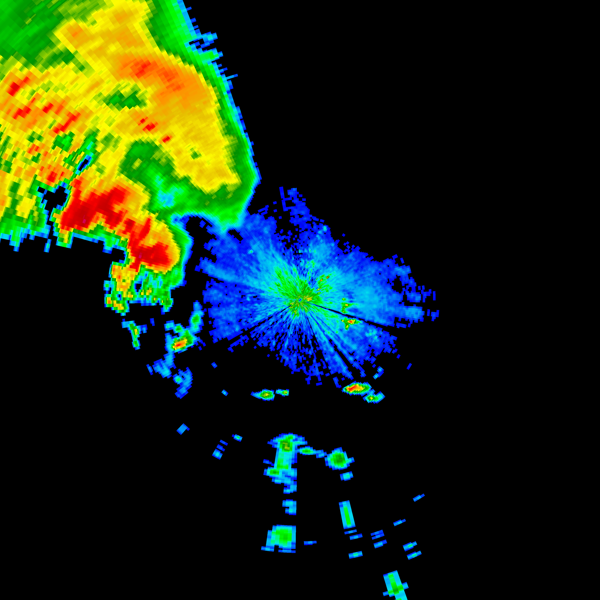

Decode CINRAD (China New Generation Weather Radar) data

[PyCINRAD](https://github.com/CyanideCN/PyCINRAD/)

## Usage Introduction
### io::level2
获取仰角
```rust
let tilt = 0;
f.get_azimuth(tilt); //获取特定仰角方位角
f.get_tilt(tilt); //获取特定仰角高度
> Ok(0.4833984375)
f.get_tilt_all(); //获取所有仰角高度
> Ok([0.4833984375, 0.4833984375, 1.40625, 1.4501953125, 2.4169921875, 3.33984375, 4.306640625, 5.9765625, 9.84375, 14.5458984375, 19.51171875])
```
获取数据
```rust
let tilt = 0;
let drange = 230;
let dtype = "REF";
f.get_reso(dtype); //获取径向分辨率
> Ok(1.0)
f.get_data(tilt, drange, dtype); //获取数据
```
### The latest progress



